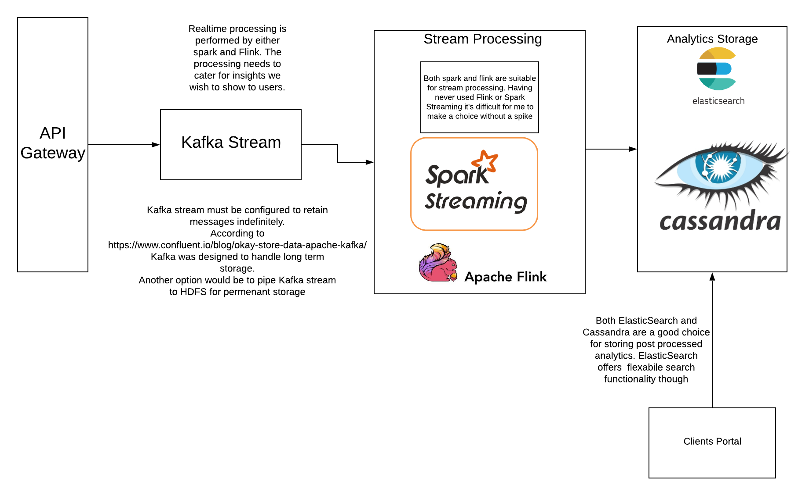

# PaytmLabs SDE Challenge

## Coding Question

Write an interface for a data structure that can provide the moving average of the last N elements added, add elements to the structure and get access to the elements. Provide an efficient implementation of the interface for the data structure.

### Minimum Requirements

1. Provide a separate interface (IE `interface`/`trait`) with documentation for the data structure
2. Provide an implementation for the interface
3. Provide any additional explanation about the interface and implementation in a README file.

---

### Solution
[MovingAvg](moving_avg/src/main/scala/mz/MovingAvg.scala) offers a data structure that calculates the moving average of last N elements added:
- implementation in Scala
- Stores all items in internal Array
- When the Array is 75% full, it gets resized
- While adding new item, variable `sum` keeps the sum of last N added elements, this optimises the process of calculating moving avg 
- Few unit tests available in [MovingAvgTest](moving_avg/src/test/scala/MovingAvg.scala)
---
## Design Question

Design A Google Analytic like Backend System.
We need to provide Google Analytic like services to our customers. Please provide a high level solution design for the backend system. Feel free to choose any open source tools as you want.

### Requirements

1. Handle large write volume: Billions of write events per day.
2. Handle large read/query volume: Millions of merchants wish to gain insight into their business. Read/Query patterns are time-series related metrics.
3. Provide metrics to customers with at most one hour delay.
4. Run with minimum downtime.
5. Have the ability to reprocess historical data in case of bugs in the processing logic.

---
### Solution
I came up with two designs:

### Using OpenSource Tools

### Using AWS Tools

